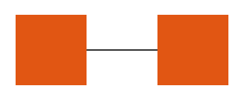

# Kendo Diagramming Overview

## Basic setup

### Create a simple HTML div (optionally set a height and width with CSS)

    

### Initialize the Kendo UI Diagram with default configuration

       $(document).ready(function() {
           $("#diagram").kendoDiagram();
       });
    

This renders an empty diagramming surface and unless you look at the resulting HTML you won't see any changes on a visual level.

The actual diagramming API can be accessed by calling the data() method;

     var diagram = $("#diagram").kendoDiagram().data("kendoDiagram");

### Adding shapes

To add a rectangular shape to the diagram you simply call the addShape() method;

    diagram.addShape();

which will render a rectangle in the upper-left corner of the diagram surface. To have a different initial position you would call the addShape() method with an additional Point parameter, for example;

    var Point = kendo.dataviz.diagram.Point;
    diagram.addShape(new Point(100,220));

Additional properties can be specified via the options parameter. For instance, you can set the background color of the shape like so;

    diagram.addShape(new Point(100,220), { background: "red" });

A more complete overview of the options can be found in the API documentation.

The addShape() method also accepts a Shape instance, so you can also add a new shape as follows;

	var Point = kendo.dataviz.diagram.Point;
    var shapeInstance = new kendo.diagram.Shape();
    var shape = diagram.addShape(shape);
    shape.position(new Point(100,220));

### Adding connections

Shapes can be connected using the connect() method;

	var Point = kendo.dataviz.diagram.Point;
    var shape1 = diagram.addShape(new Point(100,100));
    var shape2 = diagram.addShape(new Point(300,100));
    var connection = diagram.connect(shape1, shape2);

which results in something like the picture below

### Layout

Diagram layout consists in an automatic organization of a diagram on the basis how its shapes are connected (the so-called incidence structure). The layout() method is the gateway to a variety of layout algorithms. To see the effect of the layout method you can generate a random diagram and call the method like so;

    diagram.randomDiagram();

this will give a random diagram, something like the follwing;

and upon calling the layout method

    diagram.layout();

you will see a diagram similar to this:

The default layout algorithm is the top-down tree layout. You can change this to another type (and subtype) by inserting it in the layout options;

    diagram.layout({ type: "ForceDirected" });

which would give something like

Other layout types and options are discussed in the API.

### Data binding

Make sure you have read [the general overview of how databinding works in Kendo](http://docs.kendoui.com/getting-started/framework/datasource/overview "Kendo data binding.") first since it contains essential information which applies to the diagramming framework as well.

There are various ways you can define and customize data binding and we'll only scratch the surface in this overview. The easiest way to create a hierarchical diagram is by passing a dataSource as an option together with a Kendo template like so;
    var diagram = $("#diagram").kendoDiagram({
        theme: "default",
        dataSource: [{
          "name": "Telerik",
          "items": [{
            "name": "Kendo"
          }, {
            "name": "Icenium"
          }]
        }],
        shapeDefaults: {
          content: {
            template: "#= item.name #"
          }
        }
    }).data("kendoDiagram");
    diagram.layout();

which produces a tree diagram with the default rectangular shapes;

Alternatively, you can define the data binding through the setDataSource method;

    diagram.options.template = "#= item.name #";
    diagram.setDataSource([{"name": ... }]);

If you need more flexibility you can fully control where and how data is displayed by defining a visualTemplate option rather than the template option. This entails the creation of a function which returns a visual, usually a Group element containing other visuals bound to your data. For instance, the following snippet reproduces the same diagram but with ellipses rather than the previous rectangular shapes:

    var getVisual = function(options) {
        var dataviz = kendo.dataviz;

        var g = new dataviz.diagram.Group({
            autoSize: true
        });

        var r = new dataviz.diagram.Circle({
            width: 100,
            height: 60,
            background: "LimeGreen"
        });

        g.append(r);

        var fn = new dataviz.diagram.TextBlock({
            text: data.name,
            fontSize: 16,
            x: 30,
            y: 30
        });

        g.append(fn);
        return g;
    };

    var diagram = $("#canvas").kendoDiagram({
        dataSource: [{
            "name": "Telerik",
            "items": [
                {"name": "Kendo"},
                {"name": "Icenium"}
            ]
        }],
        visualTemplate: getVisual
    }).data("kendoDiagram");
    diagram.layout();

Note that the function returning a visual has a parameter containing the data item to be displayed.
The result of this custom data binding would look something like this;

